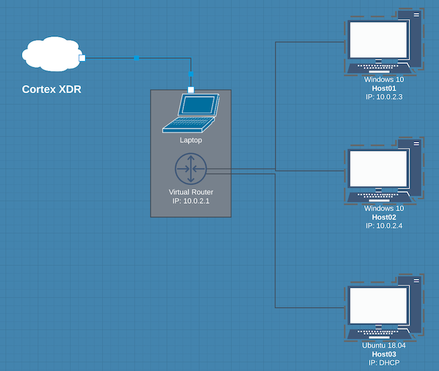

# Cortex XDR Atomic Testing

## Description of Project
This project is designed to build a test environment for Palo Alto Networks Cortex XDR solution.  The idea is to build a simple testing environment by simply typing "vagrant up".  This project builds hosts that come with [Atomic Red Team](https://github.com/redcanaryco/atomic-red-team) tests.  It will automatically install the Cortex XDR agent on the endpoints.  The agents are installed as a Temporary Session.  Therefore the hosts will be automatically removed from Cortex XDR 90 minutes after destruction.  

---
## Requirements
- [Vagrant](https://www.vagrantup.com/) 
- [Virtualbox](https://www.virtualbox.org/wiki/Downloads)
- Cortex XDR Agent
- Windows 10 Pro Licenses
- Disk Space (20 GB should be sufficient)

---
## How To Video

---
## Default Setup
1. **git clone https://github.com/scottbrumley/palo-xdr-testing.git or Download from GitHub**
2. **Copy XDR Agent installer into project palo-xdr-testing**
3. **Optional Cymulate Testing Agent**
4. **Add Two Windows 10 Pro License Keys to scripts/keys.bat**
5. **vagrant up**

### Agents
Include agents in a directory called private in your project directory
- Cortex Windows Agent = cortexxdr.msi
- Cortex Linux Agent = linuxos.sh
- Cymulate Windows Agent = Cymulate.msi (Optional)
- Cymulate Linux Agent = Cymulate.zip (Optional)

### Example Key File
Put the Windows License keys in the private directory.  Name it keys.bat.  If Cymulate testing agent is used.
   ~~~
   @echo off
   set HOST01=<Windows Key for HOST01>
   set HOST02=<Windows Key for HOST02>
   set CYMULATE=
   ~~~       

---
## Default Testing (includes two windows hosts and a linux host)
1. vagrant ssh host01
2. powershell c:\vagrant\atomic-test\all-windows-test.ps1
3. vagrant ssh host03
4. /vagrant/atomic-test/all-linux-test.sh
---

# Lab Design
- host01 = windows attack host
- host02 = windows victim host
- host03 = linux host

**--** *You can run individual tests inside c:\vagrant\atomic-test\windows on windows*

**--** *You can run individual tests inside /vagrant/atomic-test/linux on linux*
___
## Default Destruction of Virtual Hosts
1. **vagrant destroy -f**

## Accessing The Hosts
You can Remote Desktop into the host or SSH.

**username:** vagrant
**password:** vagrant

### RDP
   **vagrant rdp (host01 or host02)**

### SSH
   **vagrant ssh (host01 or host02)**
   
  ## Building Base Box
  VAGRANT_VAGRANTFILE=Vagrantfile-build vagrant up
  
  ## Building Run Box
  vagrant up
  